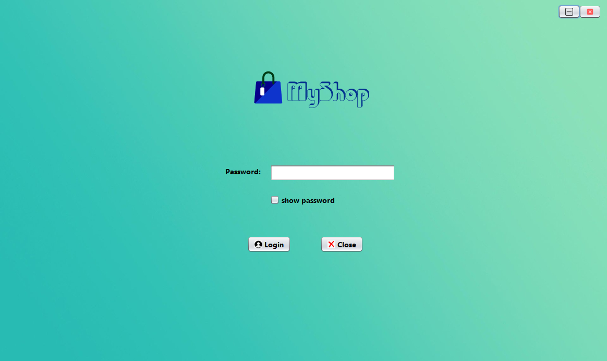
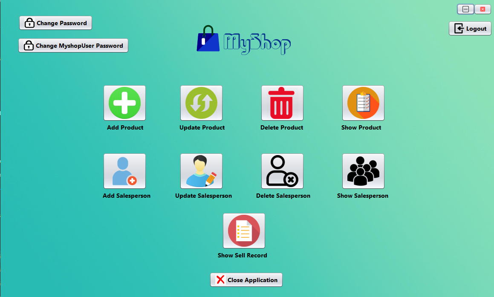

# MyShop-Admin

Technology used: Java Swing, MySQL

It is the admin side software for the project MyShop which is a supermarket billing and product management software.

#### Functionalities

<ul>
    <li>With this software, admin can manage product and their salespersons info into the database.</li>
    <li>Can see the info of products and their salesperson.</li>
    <li>Can see all the sales records.</li>
    <li>Can change login password of this software and also the user side software.</li>
</ul>

#### Sample pictures

